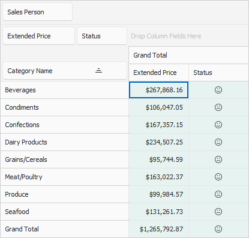

<!-- default badges list -->

<!-- default badges end -->

# Pivot Grid for WinForms - Display KPI Graphics 

The following example shows how to display KIP graphics in the Pivot Grid bound to the Northwind database. The image below illustrates the resulting UI.

## Files to Review

[Form1.cs](./CS/WindowsFormsApp_RegularDataSourceKPI/Form1.cs) (VB: [Form1.vb](./VB/WindowsFormsApp_RegularDataSourceKPI/Form1.vb))

## Example Overview

To display KPI graphics, create a Pivot Grid field and bind it to the following expression:

`(Iif(Sum([{0}])<100000,-1,Iif(Sum([{0}])<150000,0,1)))", fieldExtendedPrice.ExpressionFieldName)`

The field values depend on the "Extended Price" field values: if the "Extended Price" field value is less than 100000, the field value is "-1", if the "Extended Price" field value is less than 150000, the field value is "0". In other cases, the field value is "1".

Use the [PivotGridFieldBase.KPIGraphic](https://docs.devexpress.com/CoreLibraries/DevExpress.XtraPivotGrid.PivotGridFieldBase.KPIGraphic) property to specify a graphic set used to visualize field values.

## Documentation

[Key Performance Indicators (KPIs)](https://docs.devexpress.com/WindowsForms/8390/controls-and-libraries/pivot-grid/data-analysis/key-performance-indicators-kpis)

## More Example

[Pivot Grid for WinForms - Apply Format Rules to the Data Cells](https://github.com/DevExpress-Examples/winforms-pivot-grid-apply-format-rules-to-data-cells)

